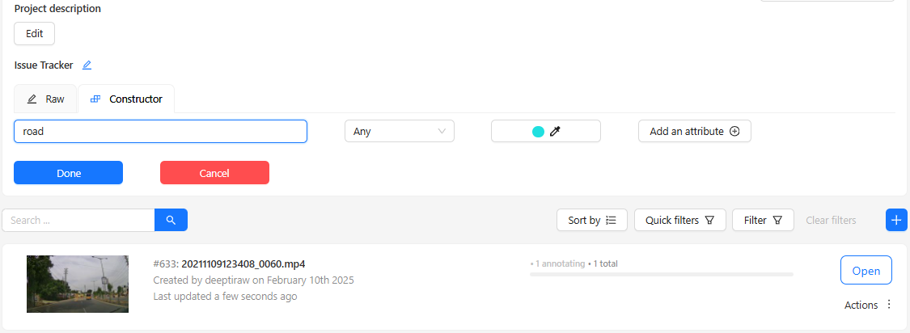
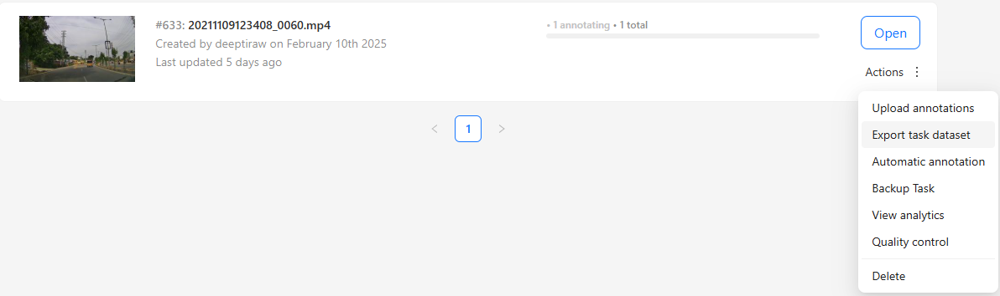

# yolo-2-cvat

Description:
This repository provides steps to convert the segmentation masks generated via YOLOv11 to an annotation format suitable to upload to CVAT server. This code can be adapted for other models as well.

My use-case:
I need to annotate videos with the label 'road'.
For this, I generate pseudo-annotations by finetuning a segmentation model on an existing dataset and then refine those annotations with the help of CVAT software.

**Step 0**: Upload a video on CVAT and edit the constructor by adding the labels of interest (in this case 'road')

**Step 1**: Download the XML of this video, by exporting the task. While exporting the task, I use the 'CVAT for video 1.1' export format.

**Step 2**: For generating pseudo-annotations for this video, and for saving them in XML (obtained from Step 1), use `yolov11_infer_masks_to_poly.py`.

The aforementioned python code, accepts video and its corresponding xml file (obtained from Step 1), infers the segmentation mask and polyline for class 'road' using YOLOv11's finetuned segmentation model, converts the inference output to the format desired or accepted via CVAT's xml file and updates the xml file. The updated annoation files (.xml) will be stored in the folder 'output_xml_annots_with_road_annotation'.